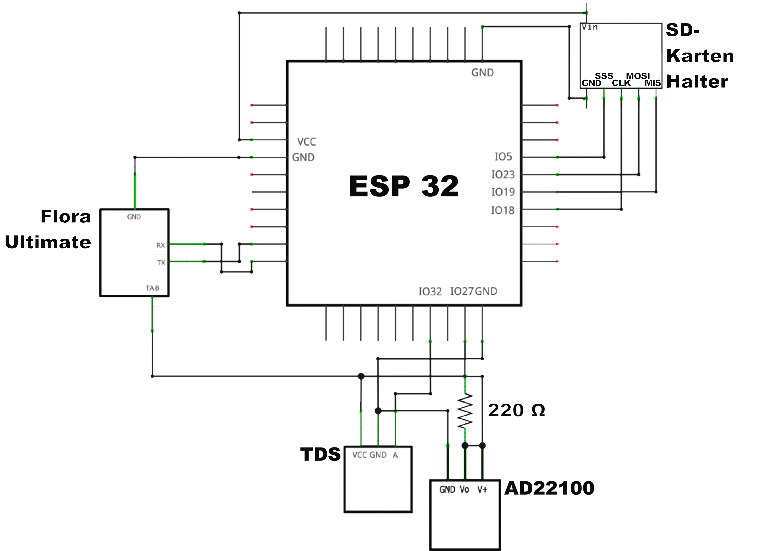

This is the source code of a GPS-logger project based on ESP32 uController.

# Features
The data logger supports the following components:
1. M6 uBlocks GPS receiver
2. DS18B20 temperatur sensor 
3. TDS sensor
2. SSD1306 OLED Display 128x64 Pixel
3. Data storage on sd-card (FAT file system)

# Installation
To install, use the Arduino IDE (V1 or V2) and add the ESP32 build environment.

# Dependencies
The following dependencies are required:
* [#include <OneWire.h>](https://www.pjrc.com/teensy/td_libs_OneWire.html)
* [#include <DallasTemperature.h>](https://github.com/milesburton/Arduino-Temperature-Control-Library)
* [#include <U8g2lib.h>](https://github.com/olikraus/U8g2_Arduino)
* [#include <TinyGPSPlus.h>](https://github.com/neosarchizo/TinyGPS)

# Wiring

# License
MIT license, check LICENSE file for more informations.

